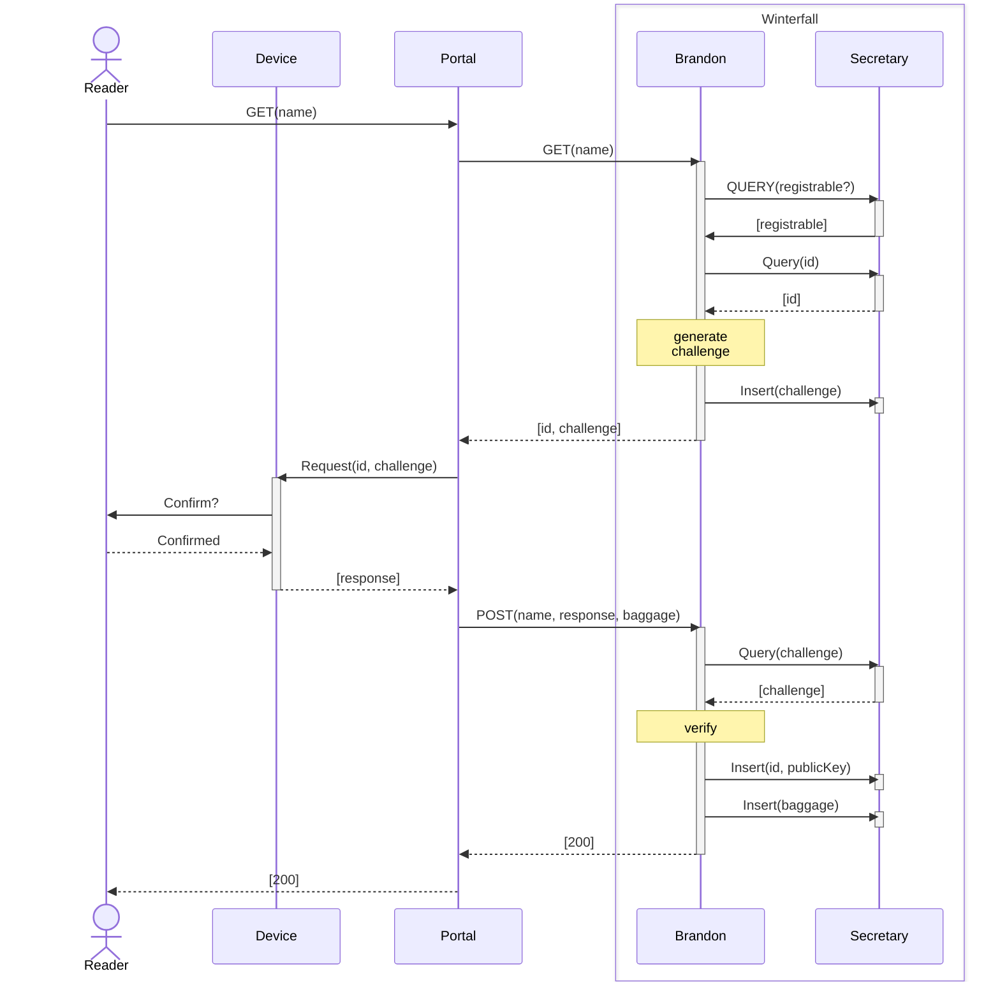
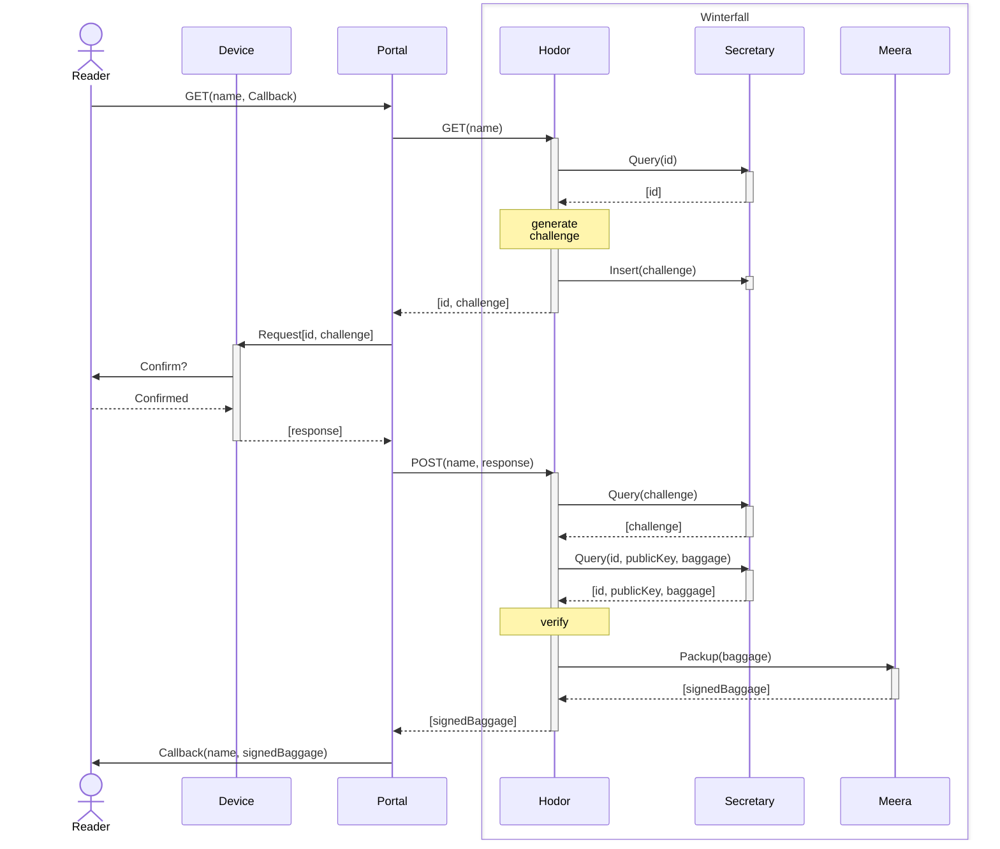

# Hodor

HOLD THE DOOOOOOOOOOOOOR

## Environment Variables

| Key              | Default | Description                                                               |
| ---------------- | ------- | ------------------------------------------------------------------------- |
| RP_NAME          | ` `     | RP Name of WebAuthn                                                       |

## Notes

### Register

### Authorization

